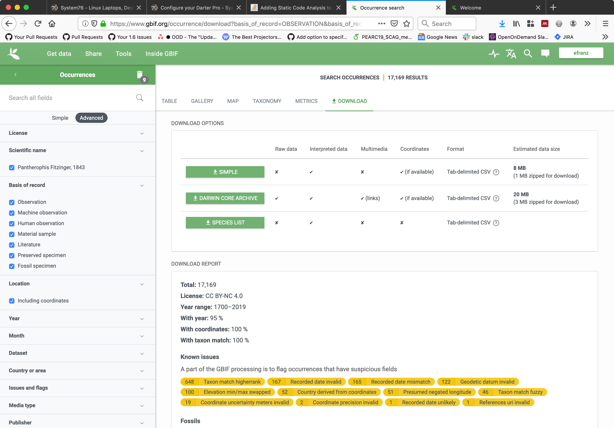
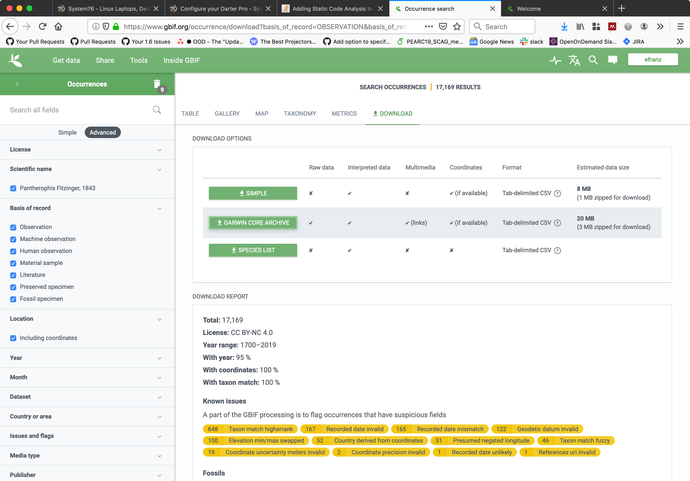
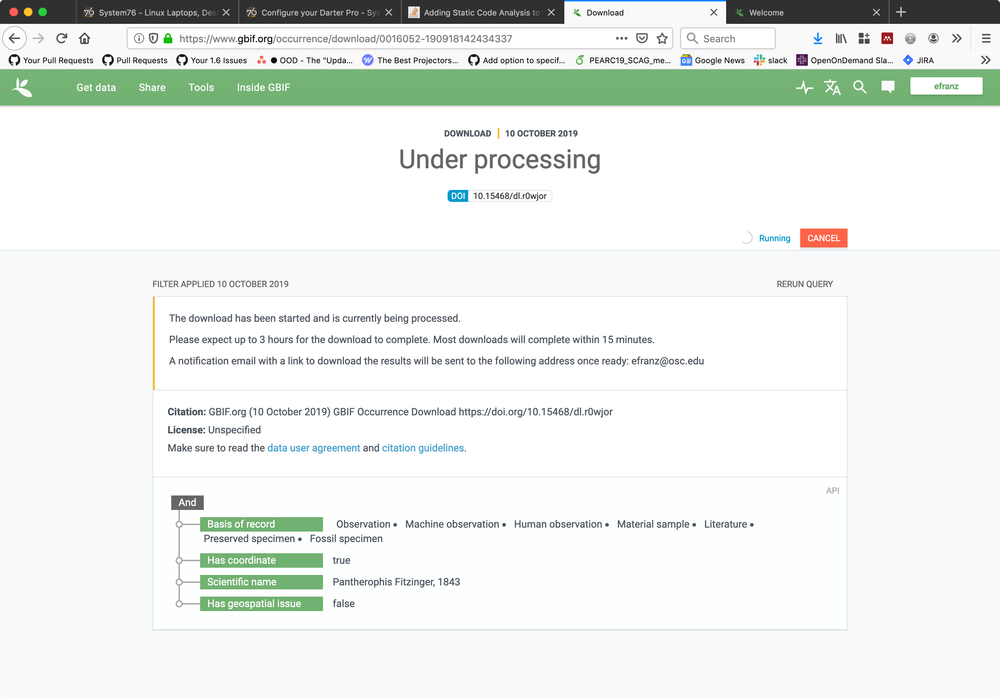
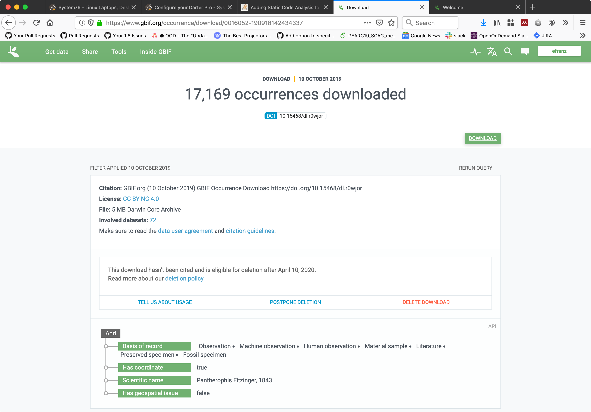

## Phylogatr

### Pipeline steps

#### 1. Download nucleotide database

In this case, we use a job `/fs/project/PAS1604/genbank/genbank_rsync.pbs`
(locally versioned in `pipeline/genbank_rsync.pbs`) to rsync all the data from
genbank ftp and expand all the .gz and .tar files in the base di /fs/project/PAS1604/genbank

gbrel.txt contains the Flat File Release number (in this case 234.0)

#### 2. Download occurrences database

GBIF provides a custom download https://zenodo.org/record/3531675
(eric_accession.zip) with columns:

- associatedSequences - accession ID column has many of the IDs wrapped in a URL. Also it can have multiple IDs separated by a | “pipe char”.
- gbifID
- decimalLatitude
- decimalLongitude
- kingdom
- phylum,
- class
- order
- family
- genus
- species
- infraspecificEpithet
- basisOfRecord,
- v_geodeticdatum
- coordinateuncertaintyinmeters
- issue

Copied to /fs/project/PAS1604/gbif_zenodo_3531675.csv

For citation purposes, the DOI of this download is to be used: 10.35000/cdl.t4hfxk.

Any columns with the string `\N` should be interpreted as NULL.

#### 3. Generate expanded accessions from occurrences file (and then )

TODO: use pipeline scripts to generate the database import tsv files and any other associated files


### Prototype exploration notes

Prototype app using [GBIF occurrence download 0016052-190918142434337](https://www.gbif.org/occurrence/download/0016052-190918142434337)

Took the following steps to do a search for this download:

- 
- 
- 
- 

Install MUSCLE binary to bin/ using wget i.e.

    cd bin
    get http://www.drive5.com/muscle/downloads3.8.31/muscle3.8.31_i86linux64.tar.gz
    tar -xzf muscle3.8.31_i86linux64.tar.gz
    rm muscle3.8.31_i86linux64.tar.gz

Install and use [Miller](https://github.com/johnkerl/miller) for parsing CSV (and tab delimited CSV files) first:

    cd ~/bin
    wget https://github.com/johnkerl/miller/releases/download/v5.6.2/mlr.linux.x86_64
    mv mlr.linux.x86_64 mlr
    chmod 755 mlr

Then can pre-parse the occurrence download for the relevant information:

    mlr --tsv cut -f gbifID,decimalLatitude,decimalLongitude,phylum,class,order,family,genus,species,associatedSequences db/seed_data/occurrence.txt | mlr --tsv filter '$associatedSequences !=~ "^[, ]*$"'


Some of the GBIF records have mismatched quotes. In that case we can try using
tsvlite:


    mlr --tsvlite cut -f gbifID,decimalLatitude,decimalLongitude,phylum,class,order,family,genus,species,associatedSequences db/seed_data/occurrence.txt | mlr --tsvlite filter '$associatedSequences !=~ "^[, ]*$"'

In the actual pipeline it is possible this tool could be used as part of a bash
pipeline to generate insert commands in to a database for each occurrence.

Note: xsv is much faster than mlr

```
efranz@owens-login01:~/ondemand/dev/phylogatr/db/seed_data (master)$ time mlr --tsv cut -f gbifID,associatedSequences,decimalLatitude,decimalLongitude,phylum,class,order,family,genus,species occurrence.txt | mlr --tsv filter '$associatedSequences !=~ "^[, ]*$"' > occurrence.txt.filtered

real	0m2.034s
user	0m2.041s
sys	0m0.042s
efranz@owens-login01:~/ondemand/dev/phylogatr/db/seed_data (master)$ time xsv select -d $'\t' gbifID,associatedSequences,decimalLatitude,decimalLongitude,phylum,class,order,family,genus,species occurrence.txt | xsv search -s associatedSequences '[^ ,]' | xsv fmt -t $'\t' > occurrence.txt.filtered.2

real	0m0.082s
user	0m0.083s
sys	0m0.021s
efranz@owens-login01:~/ondemand/dev/phylogatr/db/seed_data (master)$ diff occurrence.txt.filtered occurrence.txt.filtered.2
efranz@owens-login01:~/ondemand/dev/phylogatr/db/seed_data (master)$
```

## License

To Be Determined!
